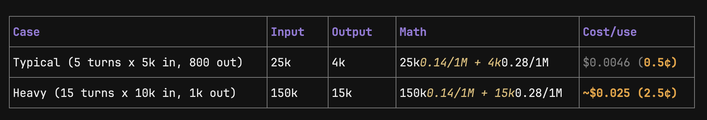

Plan: Credit-safe rate limit + DeepSeek-V4-Flash cost for 5 uses
Read-only plan — no files changed. Skipped docs/ as requested. Verified from src/routes/conversations.ts, src/agents/loop.ts, src/Provider/groq.ts, src/config/constant.ts, src/middleware/auth.middleware.ts.

1. Where your credits burn today
   Only one money-route exists:
   POST /conversations/:id/messages (routes/conversations.ts:131) → runAgent() → loop up to 15x streamTurn() (agents/loop.ts:175) + 1x summarizer LLM call per message.
   There is no limit today — only a busy check for concurrent runs. One user spamming long chats = unbounded Groq/DeepSeek + E2B spend.
2. Rate-limit design for "5 uses per user"
   Cheapest robust option — 3 layers, implement in this order:
   Layer A — Hard quota: 5 LLM runs / user (what you asked)
3. Add to Prisma User: credits Int @default(5) + usedRuns Int @default(0).
4. New middleware src/middleware/quota.middleware.ts (example):
   // check before runAgent, after AuthMiddleware
   const user = await prisma.user.findUnique({ where: { id: req.userId } });
   if (!user || user.credits <= 0)
   return res.status(402).json({ error: "Free limit over (5/5 used). Top up." });
   await prisma.user.update({
   where: { id: req.userId },
   data: { credits: { decrement: 1 }, usedRuns: { increment: 1 } }
   });
5. Apply only on POST /:id/messages, before prisma.message.create + before getLiveProjectSandbox() so failed E2B doesn't eat credit. If runAgent throws, optionally refund increment:1.
6. Frontend: show 3/5 left from GET /auth/me, disable input at 0 with upgrade CTA.
   Layer B — Cooldown (stops rapid drain)
   In-memory Map<userId, timestamp>: reject if <60s since last run with 429 + Retry-After. Prevents script loops. No DB change.
   Layer C — Token guard (lowers cost per use)

- Keep MAX_CHAT_MESSAGES=16, MAX_TOOL_OUTPUT_CHARS=4000 as is.

    

- For free-tier: skip summarizer.ts call (saves 1 LLM call/run), cap loop.ts step<15 → step<8.
- Switch provider to DeepSeek is 1-line since you use OpenAI SDK:
  // constant.ts + .env
  DEEPSEEK_BASE_URL=https://api.deepseek.com
  DEEPSEEK_MODEL=deepseek-v4-flash
  Tradeoff to confirm:
- 5 lifetime vs 5/day? Lifetime = simple credits field. Per-day = need resetAt cron.
- Count question resume as new use? Recommend no — only count initial POST messages.

3. DeepSeek-V4-Flash cost calculation (searched, July 2026 rates)
   Official pricing per 1M tokens:

- Input cache-miss: $0.14
- Input cache-hit: $0.0028 (auto prefix cache, ~50x cheaper)
- Output: $0.28
  Your per-run shape: system prompt prompt.ts ~250 tokens + history up to 16 msgs + tool outputs capped at 4000 chars (~1000 tokens each). Typical run = 4-6 streamTurn calls.
  Case Input Output
  Typical (5 turns x 5k in, 800 out) 25k 4k
  Heavy (15 turns x 10k in, 1k out) 150k 15k
  For 5 uses / user:
- Typical: 5 x $0.0046 = ~$0.023 / user
- Worst: 5 x $0.025 = ~$0.125 / user
  What a balance buys:
- $10 = ~2,170 typical uses = ~434 users x 5 uses. Worst-case = 400 uses = 80 users x 5.
- 100 users x 5 uses (500 runs) = $2.3 typical → $12.5 worst.
- With cache hits (repeat system prompt): input drops ~50%, typical falls to ~$0.003/use.
  So 5-free-uses is very safe — even 1,000 users costs roughly $23-125 in LLM, E2B sandbox time is separate.
  Note: you wrote "flash v4" — I assumed deepseek-v4-flash. There is no "DeepSeek Flash V4" separate model; deepseek-chat/reasoner aliases now route to it. If you meant Gemini-Flash, numbers differ.

4. Proposed execution order (when you approve build)
1. Prisma: add credits/usedRuns, migrate dev.
1. Add quota.middleware.ts + wire into POST /:id/messages.
1. Add GET /auth/me credits field + frontend counter.
1. Optional: swap groq.ts baseURL/model to DeepSeek via env.
1. Test: 6th request → 402, refund on 503/500, tsc --noEmit + manual run.
   Confirm before I build:
1. Lifetime 5 vs 5/day?
1. Refund credit if sandbox/LLM fails?
1. Switch provider to DeepSeek now or keep Groq + just add limits?